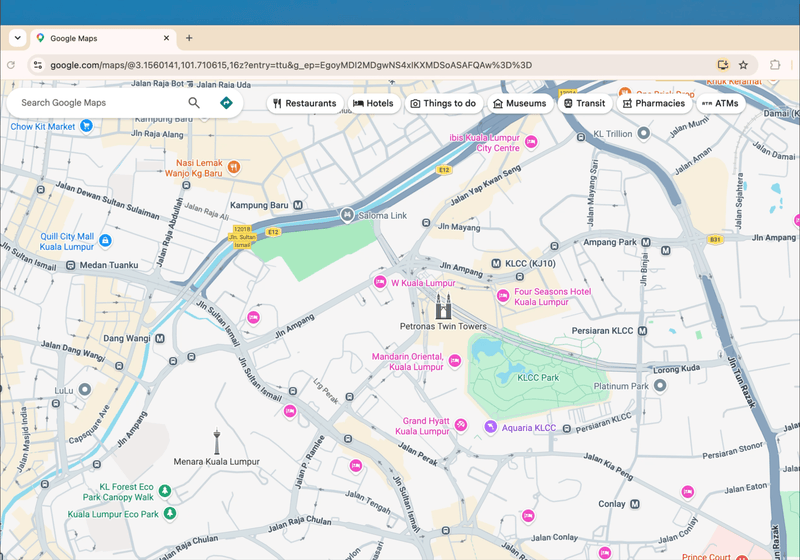

# Conteng



A macOS screen annotation application that allows you to draw overlays on top of any application using a system-wide hotkey. Conteng runs as a menu bar utility with a transparent overlay window for drawing.

**Current version:** 1.6

## Features

- **System-wide drawing overlay** - Draw on top of any application
- **Multi-monitor support** - Draw independently across every connected display
- **Global hotkey activation** - Press Option+Tab to toggle the overlay
- **Multiple drawing tools** - Various stroke widths and colors
- **Custom color palette** - Add up to eight colors with the system color picker
- **Stroke outlines** - Trace pen and arrow strokes with a thin contrasting border, with adjustable width and color
- **Rearrangeable toolbar** - Put your most-used tools first, in any order
- **Productivity tools** - Pen, translucent highlighter, stroke eraser, and arrows
- **Floating toolbar** - Switch tools, colors, and widths without leaving the overlay, with adjustable opacity that turns solid on hover
- **Custom global shortcut** - Choose the activation key and modifier combination
- **Optional auto-clear** - Wipe the canvas whenever you stop drawing
- **Safe editing history** - Undo and redo strokes, including clearing the canvas
- **Menu bar integration** - Easy access through the system menu bar
- **Keyboard shortcuts** - Quick access to common functions

## What's New in 1.6

- Adjustable toolbar opacity in Settings, from 20% to fully solid
- The toolbar turns fully solid while the pointer is over it
- Lighter settings window with borderless section cards

Version 1.5 introduced the editable color palette, the rearrangeable toolbar, and the "Clear after stop drawing" option. Version 1.4 introduced the floating toolbar on every display, the highlighter, eraser, and arrow tools, number-key tool shortcuts, and the configurable global shortcut. Version 1.3 introduced multi-monitor overlays, persistent drawings when the overlay is hidden, safe undo/redo after clearing, improved stroke smoothing, and shared drawing preferences.

## Keyboard Shortcuts

When the overlay is active:
- **Option+Tab** - Toggle overlay on/off (default; customizable in Settings)
- **Esc** - Clear all drawings
- **Cmd+Z** - Undo last stroke
- **Cmd+Shift+Z** - Redo
- **1 / 2 / 3 / 4** - Pick a tool by its position in the toolbar (set in Settings)
- **W** - Decrease stroke width
- **E** - Increase stroke width
- **R** - Rotate through the colors in your palette
- **Shift+Drag** - Draw a straight line

## Requirements

- macOS 11.5 or later
- Apple Silicon or Intel Mac
- Xcode 16.3 or later (for building from source)

## Building from Source

### Prerequisites
1. Install Xcode from the Mac App Store
2. Clone this repository

### Build Instructions

#### Using Xcode (Recommended)
1. Open the project:
   ```bash
   open Conteng.xcodeproj
   ```
2. Select the "Conteng" scheme
3. Choose Product → Build (Cmd+B) to build
4. Choose Product → Run (Cmd+R) to run the application

#### Using Command Line
1. Build the project:
   ```bash
   xcodebuild -project Conteng.xcodeproj -scheme Conteng -configuration Release -derivedDataPath ./build build
   ```

2. The built application will be located at:
   ```
   build/Build/Products/Release/Conteng.app
   ```

#### Building an App for Your Own Mac
1. Build for release:
   ```bash
   xcodebuild -project Conteng.xcodeproj -scheme Conteng -configuration Release -derivedDataPath ./build
   ```

2. The app will be built to:
   ```
   ./build/Build/Products/Release/Conteng.app
   ```

3. Copy the app to your Applications folder:
   ```bash
   cp -r ./build/Build/Products/Release/Conteng.app /Applications/
   ```

This build is ad-hoc signed, which is fine for running it yourself.

#### Creating a Release

Official releases are signed with the maintainer's self-signed `Conteng Self-Signed` certificate, so every version shares one code signing identity and macOS treats an update as the same app. To build one:

```bash
scripts/release.sh
```

The script builds a universal app, signs it, checks the signature, and writes `dist/Conteng-<version>-macOS-universal.zip` along with the SHA-256 checksum to publish in the release notes.

The certificate and its private key live only in the maintainer's keychain. Keep an exported `.p12` backup somewhere safe and never commit it: releases signed with a new certificate get a new identity. On a new Mac, double-click the backup to import it. Set `CONTENG_SIGNING_IDENTITY` to sign with a certificate of another name.

## Running Tests

Run unit tests:
```bash
xcodebuild test -project Conteng.xcodeproj -scheme Conteng -destination 'platform=macOS'
```

Run UI tests:
```bash
xcodebuild test -project Conteng.xcodeproj -scheme Conteng -destination 'platform=macOS' -only-testing:ContengUITests
```

## Installation

1. Download `Conteng-1.6-macOS-universal.zip` from the latest GitHub Release.
2. Verify its SHA-256 checksum against the value published in the release notes:

   ```bash
   shasum -a 256 ~/Downloads/Conteng-1.6-macOS-universal.zip
   ```

3. Unzip it and move `Conteng.app` into the Applications folder.
4. Launch Conteng. Its paintbrush icon will appear in the menu bar.
5. Press Option+Tab to activate the drawing overlay.

### Gatekeeper Notice

Conteng is free and open-source software distributed without an Apple Developer Program account. The downloadable app is signed with the project's own self-signed certificate, but it is **not signed with an Apple Developer ID and is not notarized by Apple**. macOS will therefore warn that it cannot verify the developer or check the app for malicious software.

Only continue if you downloaded Conteng from this repository and its SHA-256 checksum matches the release notes. After attempting to open the app once:

1. Open **System Settings**.
2. Select **Privacy & Security**.
3. Scroll to the Security section and click **Open Anyway** for Conteng.
4. Confirm by clicking **Open**.

This creates an exception for Conteng without disabling Gatekeeper globally.

To confirm that a copy was signed by this project, check its certificate fingerprint:

```bash
codesign -d -r- /Applications/Conteng.app
```

The output should include `certificate leaf = H"e35f89e9dcffacd913518a94e48c80a731640e6e"`. Every release from 1.6 onward carries this same fingerprint. See Apple's guide on [safely opening apps on macOS](https://support.apple.com/en-us/102445) for the security implications and current instructions.

## Architecture

Conteng is built using:
- **SwiftUI** for the app structure
- **AppKit** for system-level overlay functionality
- **HotKey framework** for global hotkey registration

The app uses a hybrid SwiftUI/AppKit architecture to provide system-wide overlay capabilities while maintaining a modern Swift codebase.

`DrawingDocument` owns a shared undo/redo history across display-specific overlay windows. `DrawingPreferences` provides one persisted source of truth for the selected tool, stroke width, color, toolbar order, toolbar opacity, color palette, and stroke outline. `GlobalShortcutPreferences` persists and applies the configurable activation shortcut.

## Dependencies

- **HotKey 0.2.1** - Swift Package Manager dependency for global hotkey registration

## Roadmap

### 1.7 — Capture & Sharing

- Copy the annotated screen directly to the clipboard
- Save annotations as PNG
- Capture the active monitor or a selected region
- Automatically hide the toolbar from exported captures

### 1.8 — Presentation Mode

- Temporary laser pointer
- Auto-fading strokes
- Presentation-focused controls

## License

Conteng is available under the [MIT License](LICENSE).
